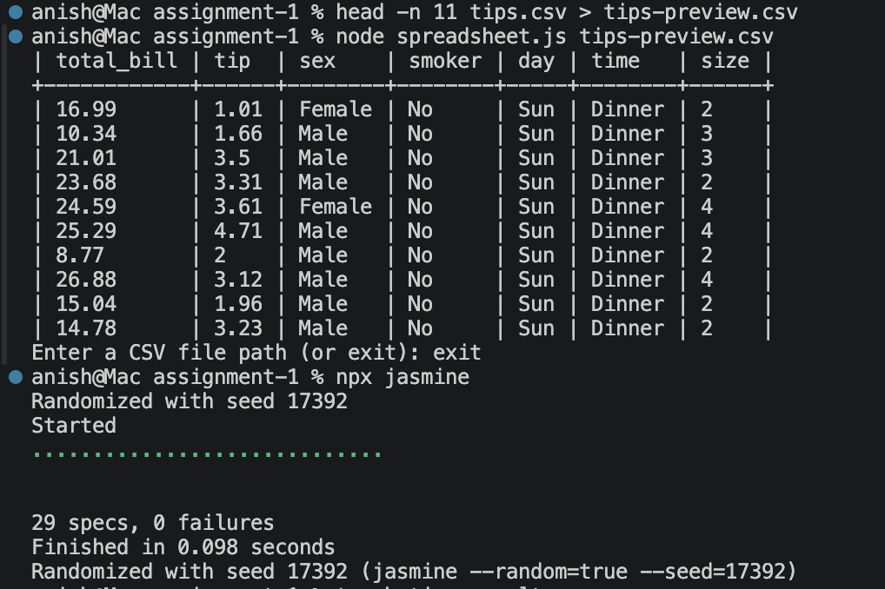
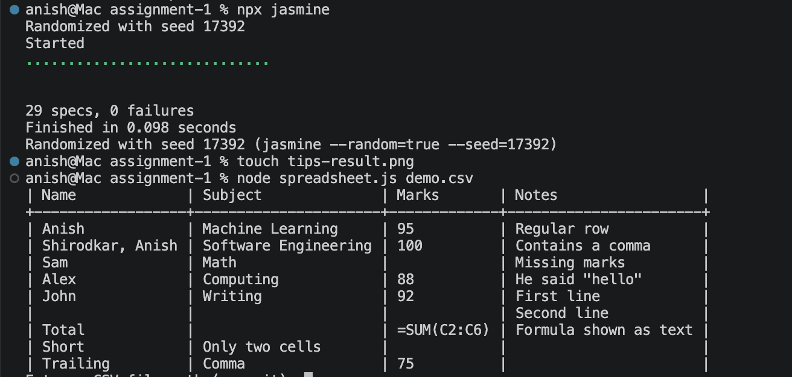

# CSV Table Printer

**Software Engineering · Assignment 1 · Problem 2.1.5**  
Anish Shirodkar · Rutgers University

A Node.js command-line program that reads CSV files and displays them as aligned, plain-text tables. Supports file selection through command-line arguments and an interactive prompt.

## Example output

```text
| Name  | Subject              | Marks |
+-------+----------------------+-------+
| Anish | Machine Learning     | 95    |
| Sam   | Math                 | 8     |
| Alex  | Software Engineering | 100   |
```

Column widths adjust to the input. Shorter values are padded with spaces so the separators stay aligned.

## Getting started

Developed and tested locally with **Node.js v20.20.2** and **npm v10.8.2**.

From the repository root:

```bash
cd assignment-1
npm ci
```

Display an example file:

```bash
node spreadsheet.js demo.csv
```

Or start with an interactive prompt:

```bash
node spreadsheet.js
```

At the prompt, enter a relative or absolute file path:

```text
Enter a CSV file path (or exit): sample.csv
```

Enter `exit` to close the program. If a file cannot be read or contains malformed quoting, the program displays an error and lets you try another file.

For command-line paths containing spaces, use quotation marks:

```bash
node spreadsheet.js "sample file.csv"
```

At the interactive prompt, enter paths **without surrounding quotation marks**. Shell commands such as `npx jasmine` should be run after exiting the program.

## Supported cases

- Quoted cells containing commas.
- Escaped quotation marks, such as `"He said ""hello"""`.
- Line breaks inside quoted cells.
- Empty cells and trailing commas.
- Rows with different numbers of cells.
- Preserved spaces and tabs displayed as four spaces.
- Windows and Unix line endings.
- Long text and numerical strings.
- Spreadsheet formulas displayed as plain text.

Missing cells in uneven rows appear blank. Multiline cells use continuation lines, keeping neighboring columns aligned.

The console display places a separator below the first row, treating it as a header. All rows are retained, including when a file has no header.

## How it works

| Function | Responsibility |
| --- | --- |
| `readFile(filename)` | Reads UTF-8 text using Node’s built-in `fs` module. |
| `parseCSV(content)` | Identifies cells and rows while tracking quotation marks. |
| `formatTable(rows, hasHeader)` | Calculates column widths and builds the table string. |
| `displayFile(filename)` | Reads, parses, and prints a file, handling errors. |
| `main()` | Processes the command-line argument and starts the interactive prompt. |

### Parsing

Splitting every line at commas would incorrectly separate a value such as `"Shirodkar, Anish"`.

The parser instead scans one character at a time. Inside a quoted cell, commas and line breaks are treated as content. Two consecutive quotation marks represent one literal quotation mark.

Malformed quoting produces an error rather than silently returning incorrect cells.

### Formatting

The formatter measures the longest display line in each column and uses `padEnd()` to add spaces to shorter values. For multiline cells, it prints enough display lines for the tallest cell in the row.

The parser and formatter return values rather than printing directly. This makes their results easier to test independently.

## Tests

Run the Jasmine suite:

```bash
npx jasmine
```

Latest local result:

```text
29 specs, 0 failures
```

| Test file | Specifications | Coverage |
| --- | ---: | --- |
| `spec/spreadsheet.spec.js` | 20 | CSV parsing, malformed quotes, alignment, multiline cells, tabs, and the header separator |
| `spec/fileIO.spec.js` | 6 | File reading, paths containing spaces, command-line input, interactive input, and error recovery |
| `spec/largeTable.spec.js` | 3 | 1,000 data rows, 200-character text, and long numerical strings |

File interaction tests create temporary files and remove them afterward. They run the actual program in a separate process to check its input and output.

## Example datasets

| File | Purpose |
| --- | --- |
| `sample.csv` | Small example for basic reading and alignment. |
| `demo.csv` | Constructed example showing unusual cells and formula text. |
| `tips.csv` | Full restaurant tips dataset downloaded from Seaborn’s data repository. |
| `tips-preview.csv` | Header and first 10 records of `tips.csv`, used for a compact screenshot. |

**Dataset source:** [Seaborn data repository — tips.csv](https://github.com/mwaskom/seaborn-data/blob/master/tips.csv)

The preview is a separate file. Creating or displaying it does not modify the original dataset.

## Screenshots

### Internet dataset and test results

First 10 records of the tips dataset, with the Jasmine test summary.



### Unusual spreadsheet cells

Demonstrates quoted text, empty cells, multiline content, uneven rows, and a formula displayed without evaluation.



## Limitations

- The entire file and formatted output are held in memory.
- Tables wider than the terminal may wrap; tall tables require scrolling.
- Padding uses JavaScript string lengths, so emoji and some Unicode characters may not align correctly.
- Input is expected to be comma-separated UTF-8 text. A UTF-8 byte-order mark is not specially removed.
- File extensions are not validated.
- Formulas remain text. Cell editing and formula evaluation are outside this assignment’s scope.

## Submission notes

`README.txt` contains the plain-text explanation for the homework submission. The submission ZIP includes the source code, tests, configuration, example datasets, and screenshots.

Dependencies in `node_modules` are excluded and can be installed using `npm ci`.